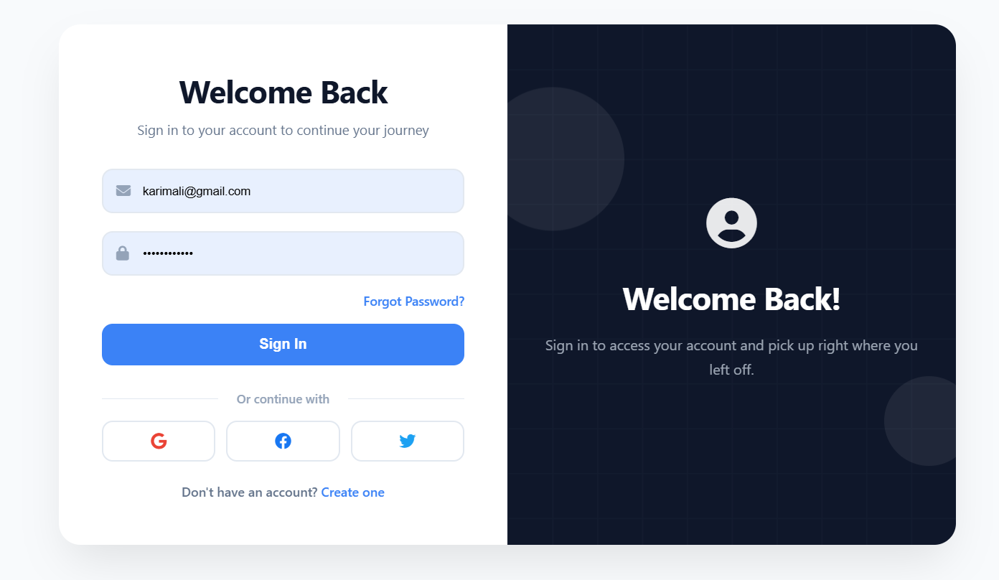
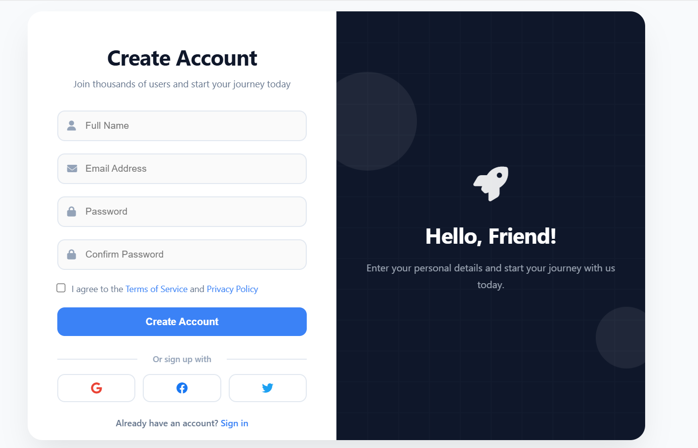
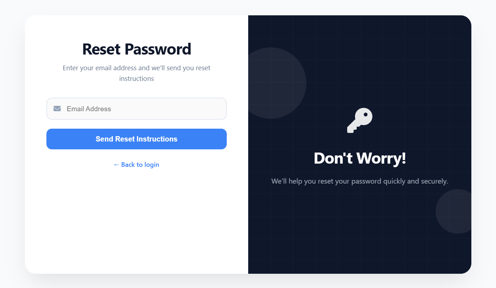

# 🔐 Login & Registration System

A full-stack user authentication system built with **Java Servlets**, **JSP**, **JDBC**, and **PostgreSQL** — demonstrating secure login/registration flows, BCrypt password encryption, and complete CRUD-based user management, all following a clean MVC architecture.

---

## ✨ Features

| Category | Details |
|---|---|
| 🔒 Authentication | Secure login & registration with BCrypt password hashing |
| 👤 User Management | Full CRUD — Create, Read, Update, Delete users |
| ✅ Validation | Frontend (JavaScript) + Backend form validation |
| 🏗️ Architecture | MVC pattern using Servlets + JSP |

---

## 🛠️ Tech Stack

**Backend**
- Java Servlets (Controller layer)
- JDBC (Database connectivity)
- BCrypt (Password encryption)

**Frontend**
- JSP, HTML5, CSS3, JavaScript

**Database**
- PostgreSQL (via DBeaver)

**Server**
- Apache Tomcat

---

## 📂 Project Structure

```
login-system-fullstack/
├── dao/          # Data Access Objects — all DB operations
├── model/        # POJOs / Data models
├── web/          # Servlets (Controllers)
└── webapp/       # UI layer — JSP, HTML, CSS, JS
```

---

## ⚙️ Setup & Installation

### Prerequisites
- Java JDK 11+
- Apache Tomcat 9+
- PostgreSQL
- IntelliJ IDEA

### Steps

1. **Clone the repository**
```bash
   git clone https://github.com/wahidali-glitch/login-system-fullstack.git
   cd login-system-fullstack
```

2. **Configure the database**
   - Create a PostgreSQL database
   - Update DB credentials in your `db.properties` or DAO config file

3. **Import into IntelliJ IDEA**
   - Open as a Maven/Gradle project
   - Let dependencies resolve

4. **Deploy to Tomcat**
   - Configure Tomcat in IntelliJ Run/Debug settings
   - Build & run the project

5. **Access the app**
```
   http://localhost:8080/login-system
```

---

## 📸 Screenshots

### 🔐 Login Page


### 📝 Signup Page


### 🔑 Forgot Password


---

## 🗺️ Roadmap

- [ ] Session management improvements
- [ ] JWT-based stateless authentication
- [ ] Role-based access control (RBAC)
- [ ] UI/UX enhancements

---

## 👨‍💻 Author

**Wahid Ali**
- GitHub: [@wahidali-glitch](https://github.com/wahidali-glitch)

---

## 📄 License

This project is open source and available under the [MIT License](LICENSE).
